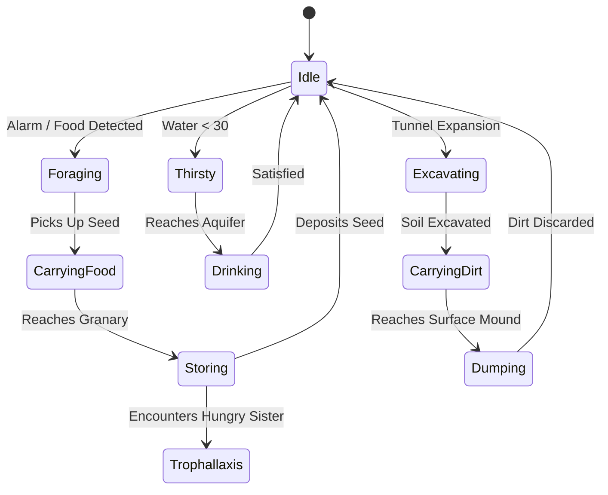

# Building Ambient Desktop Companion Sims: Architecture, UX, & Extensibility Guide

> **The "Ant Farm" Pattern**: A blueprint for developing lightweight, non-intrusive, tactile desktop companion games, virtual ecosystems, and micro-simulations.

---

## 1. Genre & Philosophy: The Ambient Desktop Companion

### What is an Ambient Desktop Companion?
An **Ambient Desktop Companion** (inspired by virtual pets like Tamagotchi, classic physical ant farms, and idle desktop ecosystems) is an interactive simulation that lives unobtrusively on the user's desktop alongside their daily productivity workflows.

Unlike conventional games that demand 100% of the player's screen, input focus, and attention:
- **Low Cognitive Load**: Runs quietly in the background without stealing window focus or interrupting work.
- **Glanceable Status**: One glance tells the user the state of their ecosystem (resource levels, health, active behaviors).
- **Tactile Micro-Interactions**: Brief, satisfying interactions (feeding, hydrating, knocking on the glass, zooming in on an agent) that take 5–15 seconds before the user returns to their primary tasks.
- **Persistent Life**: The simulation maintains continuity across launches, simulating an autonomous world that continues to function and evolve.

### Core Pillars
1. **Zero Intrusion**: Runs strictly from the system notification tray when closed. No taskbar clutter, no full-screen takeover, transparent glassmorphic aesthetic that blends into modern desktop themes.
2. **Tactile Physics**: Direct manipulation feels physical—tapping the glass sends acoustic shockwaves, dropping food creates physical debris, agents possess weight and momentum.
3. **High Performance / Low Resource Footprint**: Must consume minimal CPU (<2%) and RAM (<50MB) so users never feel the urge to close it to save battery or memory.
4. **Readable, Modular Code**: Pure, decoupled components without heavy game engines or bloated framework overhead.

---

## 2. Desktop UX & Windowing Architecture

Building a companion app on top of modern operating systems (Windows, macOS, Linux) requires a thoughtful window lifecycle.

```
┌────────────────────────────────────────────────────────┐
│                   Desktop Work Area                    │
│                                                        │
│   ┌───────────────────────────┐                        │
│   │ Floating Mode (Draggable) │                        │
│   │ [=] Header Bar            │                        │
│   │ [ Ant Farm Viewport ]     │                        │
│   │ 🌾 Food   💧 Water  ⚙ [⇲] │                        │
│   └───────────────────────────┘                        │
│                                                        │
│                                ┌─────────────────────┐ │
│                                │ Docked Mode         │ │
│                                │ [ Ant Farm Card ]   │ │
│                                └─────────────────────┘ │
├────────────────────────────────────────────────────────┤
│ OS Taskbar                         [ 🐜 Tray Icon ]    │
└────────────────────────────────────────────────────────┘
```

### 2.1 System Tray-First Lifecycle
- **Single Instance Enforcement**: Prevents multiple background processes from locking storage files or competing for screen space.
- **Tray as Anchor**:
  - **Left Click**: Toggles window visibility (instant show/hide).
  - **Right Click Context Menu**: Fast access to Window Location (`Docked` vs `Float`), `Always on Top`, Quick Care Actions (`Quick Food +5`, `Quick Water +5`), `Settings`, and `Quit`.
- **Soft Close**: Clicking the close button (`✕`) does not terminate the process; it simply hides the window back into the tray to maintain uninterrupted simulation continuity.

### 2.2 Window Modes: Docked vs. Float
- **Docked Mode**:
  - Automatically queries the primary screen's `workArea` (excluding the OS taskbar regardless of whether it is pinned at the bottom, top, left, or right).
  - Anchors the card at a consistent offset (e.g. 16px from the bottom-right corner).
  - Re-anchors automatically when display metrics, screen resolutions, or scaling factors change (`screen.on('display-metrics-changed')`).
- **Float Mode**:
  - Detaches the card into a free-floating widget that can be positioned anywhere on multi-monitor setups.
  - Remembers user coordinates `(windowX, windowY)` in local storage so it re-opens exactly where left.
  - Uses a lightweight draggable header with `-webkit-app-region: drag` while keeping buttons `-webkit-app-region: no-drag`.

### 2.3 Frameless Window Resizing Without OS Chrome
Standard operating system window borders (title bars, thick borders) shatter the illusion of a sleek, floating glassmorphic container. However, users still want custom sizing.

**Implementation Strategy**:
1. Create the window as frameless and transparent:
   ```javascript
   mainWindow = new BrowserWindow({
     frame: false,
     transparent: true,
     resizable: true,
     hasShadow: true,
     // ...
   });
   ```
2. Embed an interactive corner resize handle in the bottom-right corner of the HTML widget (`.resize-handle`).
3. On `pointerdown`, listen to global pointer movements to compute deltas:
   ```javascript
   let startX = e.screenX, startY = e.screenY;
   let startWidth = window.innerWidth, startHeight = window.innerHeight;

   function onPointerMove(ev) {
     const newW = Math.max(320, startWidth + (ev.screenX - startX));
     const newH = Math.max(140, startHeight + (ev.screenY - startY));
     window.antFarmAPI.resizeWindow(newW, newH);
   }
   ```
4. Bind an internal `ResizeObserver` or `window.onresize` event to automatically recalculate canvas pixel buffer dimensions:
   ```javascript
   function handleResize() {
     const rect = container.getBoundingClientRect();
     canvas.width = rect.width * window.devicePixelRatio;
     canvas.height = rect.height * window.devicePixelRatio;
     renderer.render(world, camera);
   }
   ```
   This guarantees that whether the window is small (340×150) or expanded across half the screen, the rendering remains razor-sharp with 0% distortion.

### 2.4 Viewport Camera: Zoom & Pan
Small desktop footprints require smart camera management so users can appreciate micro-details:
- **Scroll Wheel Zoom**: Multiplies camera scale by a damping factor (`scale *= deltaY < 0 ? 1.15 : 0.87`), clamped between `1.0x` and `4.5x`.
- **Focal Point Anchoring**: Adjusts camera pan offsets so zooming centers naturally around the mouse cursor position.
- **Pan Dragging**: When `camera.scale > 1.05`, clicking and dragging inside the canvas translates the viewport.
- **Double-Click Reset**: Restores zoom to default `1.0x` and centers the origin immediately.
- **Transient HUD Badge**: Displays a clean pill badge (`🔍 2.4x`) that smoothly fades out after 1.5 seconds of inactivity.

### 2.5 Tactile Feedback: Acoustic Glass Knock
A core delight of companion sims is physical responsiveness.
- Clicking the glass creates an expanding visual acoustic wave.
- The shockwave has physical gameplay consequences:
  - Any entity within radius `R` receives an outward impulse vector:
    $$\vec{F} = \text{normalize}(\vec{P}_{\text{ant}} - \vec{P}_{\text{click}}) \times \left(1 - \frac{d}{R}\right) \times \text{Force}$$
  - Synthesizes a resonant wooden/glass "thump" via the Web Audio API.
  - Unsticks trapped entities and causes foragers to pause and raise antennae.

---

## 3. Simulation Architecture: Dual-Layer World & Agent Design

The secret to building lifelike simulations with dozens of independent agents without frame drops is decoupling the **discrete environment** from **continuous agent kinematics**.

```
┌────────────────────────────────────────────────────────┐
│                   SIMULATION ENGINE                    │
│                                                        │
│  ┌──────────────────────────────────────────────────┐  │
│  │ Layer 1: Discrete Cellular Grid (60 × 60)        │  │
│  │ - Material Matrix: Soil, Tunnel, Aquifer, Seeds  │  │
│  │ - Moisture Diffusion & Falling Sand Automata     │  │
│  │ - Pre-Baked BFS Vector Flow Fields               │  │
│  └────────────────────────┬─────────────────────────┘  │
│                           │ O(1) Flow Lookup           │
│  ┌────────────────────────▼─────────────────────────┐  │
│  │ Layer 2: Continuous Agent Kinematics (Float X, Y)│  │
│  │ - Biologically Inspired Tripod Gait (6-Legged)   │  │
│  │ - Heading / Angular Velocity Steering            │  │
│  │ - Hierarchical Finite State Machine (FSM)        │  │
│  │ - Autonomous Stuck Detection Watchdogs           │  │
│  └──────────────────────────────────────────────────┘  │
└────────────────────────────────────────────────────────┘
```

### 3.1 Layer 1: Cellular Automata Grid
The environment is structured as a discrete grid (e.g. 60×60 cells) where each cell stores:
- `type`: `SOIL`, `EMPTY`, `TUNNEL`, `FOOD_STORAGE`, `WATER_SOURCE`
- `moisture`: scalar value driving plant growth or soil softness
- `durability`: hits required to excavate

**Why this works**:
- Soil excavation simply changes cell type from `SOIL` to `EMPTY`.
- Gravity physics (falling sand/seeds) can run on cellular rules (Euler step).
- Memory footprint is minuscule (<15 KB).

### 3.2 Layer 2: Continuous Agent Kinematics
Agents do not hop from grid tile to grid tile like chess pieces; they move smoothly across floating-point coordinates `(x, y)`:
- **Heading Vector & Turning Arc**: Agents turn with maximum angular velocity $\Delta \theta$, creating natural curves instead of instant snaps.
- **Procedural Gait Kinematics**:
  - Avoid pre-rendered sprite sheets. Instead, draw limbs programmatically!
  - For an ant, employ an **alternating tripod gait**:
    - Group A: Left Front, Right Middle, Left Rear
    - Group B: Right Front, Left Middle, Right Rear
    - Calculate leg tip positions using sinusoidal offsets synchronized with agent velocity:
      $$x_{\text{foot}} = x_{\text{hip}} + \cos(\theta + \phi) \cdot r + \sin(\omega t) \cdot \text{stepSize}$$
  - Antenna twitching based on Perlin noise or high-frequency sine oscillators.
  - **Benefits**: Infinite resolution scaling, zero asset loading, dynamic leg movement that speeds up or slows down proportionally with the entity's velocity.

### 3.3 The Maze Pathfinding Problem: Why BFS Flow Fields Win
In winding burrows, straight vector navigation causes agents to get hopelessly stuck in dead ends. However, computing per-agent $A^*$ pathfinding every frame across 50+ ants causes significant CPU spikes.

**The Solution: Static/Semi-Dynamic Flow Fields (Distance Transforms)**:
1. Whenever the map changes (or on periodic intervals), run a Breadth-First Search (BFS) from goal regions:
   - `surfaceFlow`: BFS outward from the top burrow entrances.
   - `granaryFlow`: BFS outward from the food storage chambers.
   - `waterFlow`: BFS outward from the subterranean aquifer.
2. Store the resulting direction vector $\vec{D} = (\Delta x, \Delta y)$ in each cell.
3. **Runtime Execution**: When an ant needs to return to the surface, it reads `surfaceFlow[cellY][cellX]` in **$O(1)$ constant time**!
   - 100 ants can pathfind through complex tunnels simultaneously with zero performance degradation.

### 3.4 Finite State Machine (FSM)
Each entity operates on an explicit, easily readable state machine:



### 3.5 Anti-Stuck Watchdogs
In procedural physics, agents can occasionally wedge into tight corners. A robust simulation must be self-healing:
1. Every agent tracks displacement over time:
   ```javascript
   if (dist(currentPos, lastCheckedPos) < 0.2) {
     stuckTimer += deltaTime;
     if (stuckTimer > 1.2) { // Stuck for 1.2s
       resolveStuck(world);
     }
   } else {
     stuckTimer = 0;
   }
   ```
2. **Resolution Strategies**:
   - Reverse heading by $180^\circ + \text{random}(-45^\circ, +45^\circ)$.
   - Query the nearest cell with an open flow vector.
   - Apply a micro-teleport if trapped inside solid geometry.

---

## 4. Code Cleanliness & Architectural Principles

To ensure this codebase is easily understood, maintained, and extended by any developer, the architecture strictly adheres to three core design rules:

### 4.1 Strict Separation of Concerns

```
ant-farm/
├── electron/                   # SYSTEM BOUNDARY (Node.js)
│   ├── main.js                 # App lifecycle, native OS menus, window bounds
│   ├── preload.js              # Secure IPC API bridge (Context Isolation)
│   ├── tray.js                 # Tray icon, context menu, docking math
│   └── store.js                # JSON persistence (colony state, preferences)
├── src/                        # PRESENTATION & ENGINE (Vanilla Web Standards)
│   ├── index.html              # Clean semantic HTML layout
│   ├── css/                    # Modular styles (widget.css, settings.css)
│   └── js/
│       ├── app.js              # View controller (event listeners, DOM binding)
│       ├── audio/sound.js      # Procedural sound synthesizer (Web Audio API)
│       └── sim/                # PURE SIMULATION LOGIC (No DOM dependencies)
│           ├── world.js        # Terrain grid, flow fields, CA rules
│           ├── ant.js          # Kinematics, gait, state machine
│           ├── species.js      # Species morphology and trait definitions
│           ├── simulation.js   # Lifecycle, tick loop, resource metabolism
│           └── renderer.js     # 2D Canvas drawing routines
```

- **Simulation is Headless**: `world.js`, `ant.js`, and `simulation.js` have **zero DOM references** (`document`, `window`). They can be tested headlessly in Node.js or run inside a Web Worker.
- **Renderer is Passive**: `renderer.js` receives `(world, ants, camera)` and draws them. It does not mutate simulation state.

### 4.2 Decoupled Timestep Game Loop
Avoid coupling physics updates to `requestAnimationFrame` monitor refresh rates (which can vary between 60Hz, 144Hz, and 240Hz):

```javascript
let lastTime = performance.now();
const FIXED_STEP = 1 / 60; // 60Hz physics
let accumulator = 0;

function gameLoop(currentTime) {
  const frameDelta = Math.min((currentTime - lastTime) / 1000, 0.1);
  lastTime = currentTime;
  accumulator += frameDelta * simulationSpeed;

  // Run fixed physics steps
  while (accumulator >= FIXED_STEP) {
    simulation.update(FIXED_STEP);
    accumulator -= FIXED_STEP;
  }

  // Render current state
  renderer.render(simulation.world, simulation.ants, camera);
  requestAnimationFrame(gameLoop);
}
```
**Benefits**:
- Simulation speed multipliers (`0.5x`, `1.0x`, `2.0x`, `5.0x`) work cleanly without breaking collision physics or causing tunneling.
- Consistent behavior across high-refresh displays.

### 4.3 Procedural Audio Synthesis (Zero File Assets)
Desktop companions should not require large MP3/WAV asset libraries. The Web Audio API provides infinite, zero-latency, reactive audio:
- **Water Drop**: Sine wave with high-to-low exponential frequency ramp (`1200Hz -> 300Hz` over 80ms).
- **Seed Crunch / Digging**: White noise buffer passed through a bandpass filter with randomized Q factors.
- **Glass Knock**: Decaying triangle wave with bandpass resonance (`450Hz` with $Q=12$).

---

## 5. Plugin & Extension Architecture (Mods & Community Systems)

A major goal for extensible companion games is allowing developers to add new content, mechanics, and visual themes without modifying core engine files.

### 5.1 Plugin Architecture Overview

```
               ┌───────────────────────────────┐
               │         PluginManager         │
               └───────────────┬───────────────┘
                               │
       ┌───────────────────────┼───────────────────────┐
       ▼                       ▼                       ▼
┌──────────────┐       ┌──────────────┐       ┌──────────────┐
│ Species Pack │       │ Weather Mod  │       │ Predator Mod │
│  Plugin      │       │  Plugin      │       │  Plugin      │
└──────────────┘       └──────────────┘       └──────────────┘
```

### 5.2 Plugin Manifest: `plugin.json`
Every plugin defines a manifest describing its identity and entry point:

```json
{
  "id": "com.community.ladybugs",
  "name": "Ladybug Visitors Pack",
  "version": "1.0.0",
  "author": "EntomologyEnthusiast",
  "description": "Adds friendly ladybug surface visitors that eat aphids and interact with ants.",
  "main": "plugin.js",
  "permissions": ["spawn_entity", "register_species", "listen_events"]
}
```

### 5.3 The Plugin Lifecycle Interface
A plugin exports a class or object implementing standard hook methods:

```javascript
export class LadybugPlugin {
  /**
   * Called when the plugin is loaded into the engine.
   * @param {PluginContext} ctx - Sandboxed API giving access to register APIs.
   */
  init(ctx) {
    this.ctx = ctx;

    // Register a new creature type
    ctx.registerEntity({
      type: 'ladybug',
      spawnLocation: 'surface',
      update: (ladybug, world, deltaTime) => {
        // Custom movement logic along the surface soil
        ladybug.x += ladybug.vx * deltaTime;
        if (ladybug.x < 2 || ladybug.x > world.width - 2) ladybug.vx *= -1;
      },
      render: (ladybug, renderContext) => {
        // Custom 2D canvas drawing for shiny red shell and black dots
        renderContext.drawCircle(ladybug.x, ladybug.y, 4, '#ff3344');
        renderContext.drawDots(ladybug.x, ladybug.y, 3, '#000000');
      }
    });

    // Register sound effect
    ctx.registerSound('ladybug_flutter', () => {
      // Custom Web Audio synthesis
    });
  }

  /**
   * Called every physics tick.
   */
  onTick(world, deltaTime) {
    // Check if ladybug encounters an ant
  }

  /**
   * Called when the user knocks on the glass.
   */
  onGlassKnock(coords, force) {
    // Ladybugs take flight when glass is tapped!
  }

  /**
   * Cleanup resources when plugin is disabled.
   */
  destroy() {
    // Unsubscribe events
  }
}
```

### 5.4 The `PluginManager` Implementation Blueprint
Here is how clean and simple a `PluginManager` can be:

```javascript
export class PluginManager {
  constructor(simulation, renderer, sound) {
    this.sim = simulation;
    this.renderer = renderer;
    this.sound = sound;
    this.plugins = new Map();
  }

  registerPlugin(pluginInstance) {
    const context = {
      registerSpecies: (key, def) => this.sim.registerSpecies(key, def),
      registerEntity: (def) => this.sim.registerCustomEntity(def),
      registerSound: (name, synthFn) => this.sound.register(name, synthFn),
      addCanvasLayer: (layerFn) => this.renderer.registerCustomLayer(layerFn),
      on: (event, cb) => this.sim.events.on(event, cb)
    };

    pluginInstance.init(context);
    this.plugins.set(pluginInstance.id, pluginInstance);
  }

  dispatchTick(deltaTime) {
    for (const plugin of this.plugins.values()) {
      if (plugin.onTick) plugin.onTick(this.sim.world, deltaTime);
    }
  }

  dispatchGlassKnock(coords, force) {
    for (const plugin of this.plugins.values()) {
      if (plugin.onGlassKnock) plugin.onGlassKnock(coords, force);
    }
  }
}
```

---

## 6. DLC & Content Expansion Packs Architecture

DLC (Downloadable Content) in an ambient companion should feel like unpacking a brand-new physical habitat or discovering a rare specimen.

### 6.1 Content Pack Types
1. **Species Expansion Packs** (e.g., *Leafcutter Colony*, *Weaver Ants*, *Trap-Jaw Ants*):
   - Adds unique behavioral routines (e.g. cutting vegetation on the surface, silk-weaving chambers, high-speed mandibular snaps).
2. **Substrate & Biome Packs** (e.g., *Desert Dunes*, *Rotting Forest Log*, *Transparent Gel Farm*, *Beehive Hexagon Grid*):
   - Introduces new soil physics, friction values, and background shaders.
3. **Cosmetics & Enclosure Skins**:
   - Dark Obsidian Glass, Polished Mahogany Wood Frame, Retro CRT Enclosure, Cyberpunk Neon Terrarium.

### 6.2 Data-Driven Registry Pattern
To support DLC seamlessly, core engines should **never hardcode lists**. Everything should flow through dynamic registries:

```javascript
// Registry Pattern in species.js
export const SPECIES_REGISTRY = new Map();

export function registerSpecies(key, definition) {
  SPECIES_REGISTRY.set(key, {
    name: definition.name,
    scientific: definition.scientific,
    color: definition.color || '#2d251e',
    abdomenColor: definition.abdomenColor || definition.color,
    scale: definition.scale || 1.0,
    speedMultiplier: definition.speedMultiplier || 1.0,
    digEfficiency: definition.digEfficiency || 1.0,
    specialFeature: definition.specialFeature || 'Standard worker',
    renderCustomParts: definition.renderCustomParts || null
  });
}
```

### 6.3 DLC Manifest & Packaging
A DLC package is simply a directory or zip archive containing:
```
dlc/
└── leafcutter-pack/
    ├── dlc.json                # Metadata & compatibility version
    ├── species.js              # Species definitions & leaf-cutting AI
    ├── vegetation.js           # Surface foliage spawn mechanics
    └── assets/                 # Icons & preview thumbnails
```

---

## 7. Step-by-Step Blueprint for Creating Your Own Companion Sim

Want to create a companion game of your own (e.g., *Desktop Aquarium*, *Bonsai Tree*, *Virtual Terrarium*, *Pocket Hamster*)? Follow this 5-stage roadmap:

### Phase 1: The Headless Simulation Loop
1. Write `world.js`: Define your grid or boundary rules (water volume, soil matrix, tree branch nodes).
2. Write `agent.js`: Implement continuous kinematics (`x, y, vx, vy, heading`) and a 3-state FSM (`Idle`, `Seeking`, `Interacting`).
3. Verify headless execution by running a test script in Node.js for 100 ticks.

### Phase 2: Canvas Rendering & Viewport Controls
1. Create an HTML5 Canvas element.
2. Build `renderer.js`: Draw background tiles, followed by agent bodies using procedural canvas paths (`ctx.arc`, `ctx.bezierCurveTo`).
3. Add camera transforms:
   ```javascript
   ctx.save();
   ctx.translate(camera.x, camera.y);
   ctx.scale(camera.scale, camera.scale);
   // Draw world
   ctx.restore();
   ```
4. Hook up mouse wheel zoom and drag panning.

### Phase 3: Desktop Shell Integration (Electron)
1. Initialize Electron with `frame: false, transparent: true`.
2. Configure system tray icon with left-click toggle and right-click context menu.
3. Add screen edge docking calculation using `screen.getPrimaryDisplay().workArea`.
4. Implement custom borderless click-and-drag resizing.

### Phase 4: Direct Tactile Interactions
1. Implement mouse-click reactions (glass tap shockwaves, dropping items).
2. Wire up Web Audio API oscillators for click sounds, bubbles, or footsteps.
3. Add an autonomous anti-stuck watchdog so your pets never freeze awkwardly.

### Phase 5: Persistence & Settings
1. Save state periodically (e.g. every 60s and on app quit) to a local JSON file.
2. Create a clean settings window for custom configurations (population, window mode, opacity, sound).
3. Expose the `PluginManager` hooks for future expansions!

---

## 8. Summary Checklist for High-Quality Companion Games

- [x] **Zero system requirements**: Runs 100% locally in user space without admin/system installers.
- [x] **Minimal footprint**: Keeps RAM under 60MB and CPU under 2% during normal idle states.
- [x] **Non-intrusive**: Lives in the tray, hides cleanly, never steals keyboard focus.
- [x] **Frameless & resizable**: Looks like a floating glass artifact with smooth custom dragging.
- [x] **Flow-field pathfinding**: Uses O(1) BFS vector fields to eliminate CPU spikes.
- [x] **Procedural audio & visuals**: Crisp at any DPI without bulky audio files or pixelated sprite sheets.
- [x] **Plugin-ready**: Separates data from code so anyone can add new creatures or habitats.
